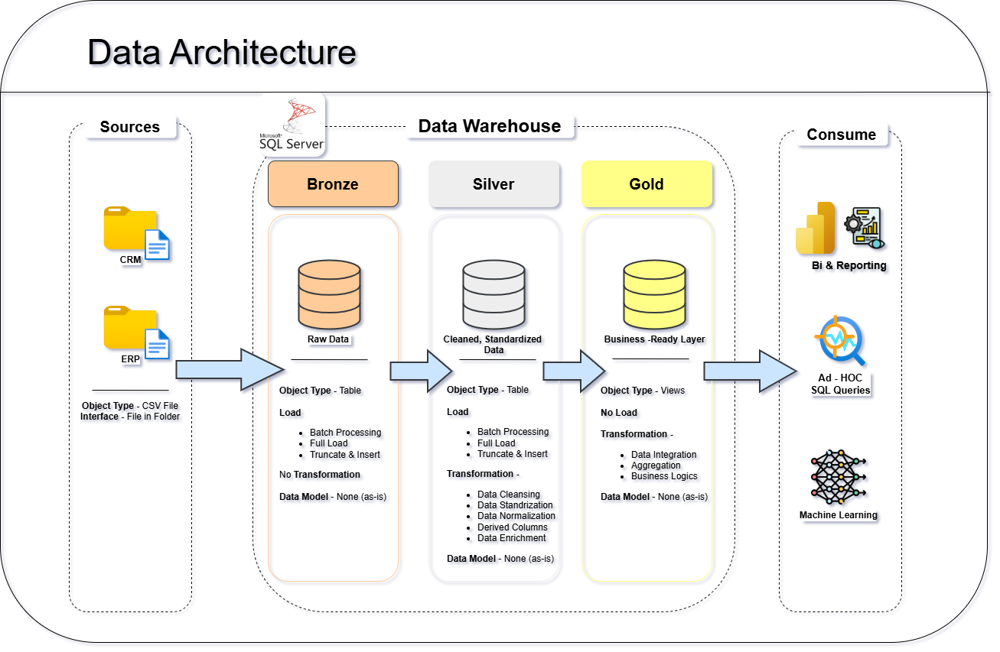
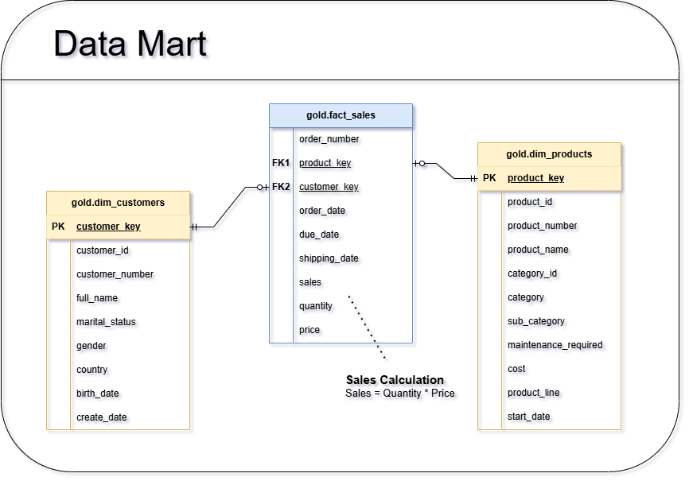

# 🏗️ SQL Data Warehouse Project

<div align="center">


**A production-style Data Warehouse built from scratch using SQL Server, Medallion Architecture, and fully automated ETL pipelines — integrating ERP and CRM data sources into a unified analytical model.**

[📂 Explore Scripts](#️-project-structure) · [📖 Data Catalog](Docs/data_catalog.md) · [🔗 Connect with Me](#-connect-with-me)

</div>

---

## 📖 Project Overview

This project implements a **modern, layered Data Warehouse** on Microsoft SQL Server 2022 Express, following the industry-standard **Medallion Architecture** (Bronze → Silver → Gold).

The warehouse consolidates sales data from two separate source systems — **ERP** and **CRM** — across **6 CSV datasets**, transforming raw, inconsistent records into a clean, business-ready analytical model designed for sales trend analysis, customer segmentation, and product performance reporting.

> **Scope note:** This project focuses on processing the latest available snapshot of data. Historical tracking (SCD/historization) is intentionally out of scope, mirroring a common real-world design decision for operational reporting warehouses.

### What this project demonstrates

| Skill Area | What was built |
|---|---|
| Data Architecture | 3-layer Medallion Architecture on SQL Server |
| ETL Development | Stored procedure–driven automated pipelines |
| Data Modeling | Star schema with fact & dimension tables |
| Data Quality | Validation scripts for Silver and Gold layers |
| Integration | Multi-source ERP + CRM data unified into one model |
| Documentation | Data catalog, flow diagrams, integration maps |

---

## 🏗️ Data Architecture

The warehouse is structured across three distinct layers, each with a specific responsibility:



### 🥉 Bronze Layer — Raw Ingestion
- All 6 source CSV files loaded **as-is**, with no transformations
- Serves as the system of record for raw data
- Tables mirror source structure exactly to preserve full audit trail
- Script: `Scripts/Bronze/ddl_bronze.sql`, `Scripts/Bronze/proc_load_bronze.sql`

### 🥈 Silver Layer — Cleansed & Standardized
- Data is cleaned, standardized, and validated
- Key transformations applied:
  - Null handling and unknown value substitution
  - Duplicate detection and deduplication
  - Date format normalization and data type casting
  - Cross-source key alignment (ERP customer IDs ↔ CRM customer IDs)
  - Unwanted prefix/suffix removal from product codes
- Script: `Scripts/Silver/ddl_silver.sql`, `Scripts/Silver/proc_load_silver.sql`

### 🥇 Gold Layer — Business-Ready Analytics
- Star schema with **fact and dimension tables** optimized for reporting
- Dimension tables: `dim_customers`, `dim_products`
- Fact table: `fact_sales`
- Surrogate keys replace source keys for clean joins
- Designed to directly power dashboards, KPI reports, and ad-hoc analysis
- Script: `Scripts/Gold/ddl_gold.sql`

---

## 🔄 ETL Pipeline

The entire pipeline is **automated via SQL Server stored procedures**, executable end-to-end from SSMS.

```
[ERP CSVs]──────┐
                ▼
[CRM CSVs]───►  Bronze Layer  ──►  Silver Layer  ──►  Gold Layer  ──►  Reports / Dashboards
                (Raw Load)         (Cleanse)           (Model)
```

**Pipeline execution order:**
1. `Scripts/init_database.sql` — creates the `DataWarehouse` database and all schemas
2. `EXEC bronze.load_bronze;` — loads all 6 source CSVs into Bronze tables
3. `EXEC silver.load_silver;` — transforms and loads into Silver tables
4. Gold DDL creates views/tables from Silver — no stored procedure needed (declarative model)
5. `Tests/quality_checks_silver.sql` + `Tests/quality_checks_gold.sql` — validate data integrity

**Challenges solved in the pipeline:**
- ERP and CRM systems used different customer ID formats — resolved via pattern-based key normalization in Silver
- Product category codes from ERP (`PX_CAT_G1V2`) had no direct equivalent in CRM — resolved by building a lookup join in the integration layer
- Several CRM records had `NULL` birth dates and invalid date values — handled with conditional CASE logic rather than hard deletes, preserving row counts for audit

---

## 📊 Data Model

The Gold layer follows a **Star Schema** — optimized for fast analytical queries.



**Tables:**

| Table | Type | Description |
|---|---|---|
| `gold.dim_customers` | Dimension | Unified customer profile from CRM + ERP location data |
| `gold.dim_products` | Dimension | Product info enriched with ERP category data |
| `gold.fact_sales` | Fact | Sales transactions with foreign keys to both dimensions |

**Key metrics the model supports:**
- Total revenue and order volume by time period
- Top customers by revenue and order count
- Product performance by category and subcategory
- Sales rep / territory analysis (via customer location dimension)

---

## 🗂️ Source Data

**6 CSV files** from two source systems:

**CRM System** (`Datasets/source_crm/`)
| File | Contents |
|---|---|
| `cust_info.csv` | Customer demographics, contact info, and account metadata |
| `prd_info.csv` | Product catalogue with names, costs, and category codes |
| `sales_details.csv` | Transactional sales records with order dates and revenue |

**ERP System** (`Datasets/source_erp/`)
| File | Contents |
|---|---|
| `CUST_AZ12.csv` | Customer birth dates and gender attributes |
| `LOC_A101.csv` | Customer country and region data |
| `PX_CAT_G1V2.csv` | Product category and subcategory reference data |

---

## ✅ Data Quality & Testing

Validation scripts are run after each load to ensure data integrity:

**Silver layer checks** (`Tests/quality_checks_silver.sql`):
- NULL checks on all primary and foreign key columns
- Duplicate detection on customer and product IDs
- Date range validation (no future dates, no dates before 1900)
- Standardization checks (consistent gender codes, country names)

**Gold layer checks** (`Tests/quality_checks_gold.sql`):
- Referential integrity between fact and dimension tables
- Duplicate surrogate key detection
- Revenue and quantity range validation (no negative values)
- Row count reconciliation between Silver and Gold

---

## 🚀 Getting Started

> **Prerequisites:** Windows OS · SQL Server 2022 Express (free) · SQL Server Management Studio (SSMS)

### Step 1 — Install the tools (all free)

| Tool | Download |
|---|---|
| SQL Server 2022 Express | [microsoft.com/sql-server](https://www.microsoft.com/en-us/sql-server/sql-server-downloads) |
| SSMS | [SSMS Download](https://learn.microsoft.com/en-us/sql/ssms/download-sql-server-management-studio-ssms) |

### Step 2 — Clone the repository

```bash
git clone https://github.com/Krishchaurasia05/SQL-Data-Warehouse-Project.git
cd SQL-Data-Warehouse-Project
```

### Step 3 — Initialize the database

Open SSMS → connect to your local SQL Server instance → open and run:

```sql
-- Creates the DataWarehouse database with Bronze, Silver, and Gold schemas
Scripts/init_database.sql
```

### Step 4 — Create table structures

Run in this order:

```sql
Scripts/Bronze/ddl_bronze.sql
Scripts/Silver/ddl_silver.sql
Scripts/Gold/ddl_gold.sql
```

### Step 5 — Update CSV file paths

In `proc_load_bronze.sql`, update the `BULK INSERT` file paths to match where you cloned the repo on your machine:

```sql
-- Change this:
BULK INSERT bronze.crm_cust_info
FROM 'C:\YOUR_PATH\Datasets\source_crm\cust_info.csv'
```

### Step 6 — Run the ETL pipeline

```sql
-- Load Bronze (raw ingestion)
EXEC bronze.load_bronze;

-- Load Silver (cleanse & transform)
EXEC silver.load_silver;
```

### Step 7 — Validate data quality

```sql
Tests/quality_checks_silver.sql
Tests/quality_checks_gold.sql
```

### Step 8 — Query the Gold layer

```sql
-- Example: Top 10 customers by revenue
SELECT TOP 10
    dc.customer_name,
    dc.country,
    SUM(fs.sales_amount) AS total_revenue,
    COUNT(fs.order_number) AS total_orders
FROM gold.fact_sales fs
JOIN gold.dim_customers dc ON fs.customer_key = dc.customer_key
GROUP BY dc.customer_name, dc.country
ORDER BY total_revenue DESC;
```

---

## 📂 Project Structure

```
SQL-Data-Warehouse-Project/
│
├── Datasets/
│   ├── source_crm/
│   │   ├── cust_info.csv           # CRM customer records
│   │   ├── prd_info.csv            # CRM product catalogue
│   │   └── sales_details.csv       # CRM sales transactions
│   └── source_erp/
│       ├── CUST_AZ12.csv           # ERP customer demographics
│       ├── LOC_A101.csv            # ERP customer locations
│       └── PX_CAT_G1V2.csv        # ERP product categories
│
├── Docs/
│   ├── data_architecture.drawio    # Editable architecture diagram
│   ├── data_architecture.png       # Medallion architecture visual
│   ├── data_catalog.md             # Full column-level data catalog
│   ├── data_flow.drawio            # Editable data flow diagram
│   ├── data_flow.png               # ETL data flow visual
│   ├── data_integration.drawio     # Source-to-target mapping (editable)
│   ├── data_integration.png        # Integration diagram
│   ├── data_mart.drawio            # Star schema (editable)
│   └── data_mart.png               # Star schema visual
│
├── Scripts/
│   ├── init_database.sql           # Creates DB + schemas (run this first)
│   ├── Bronze/
│   │   ├── ddl_bronze.sql          # Bronze table definitions
│   │   └── proc_load_bronze.sql    # Bronze ETL stored procedure
│   ├── Silver/
│   │   ├── ddl_silver.sql          # Silver table definitions
│   │   └── proc_load_silver.sql    # Silver ETL stored procedure
│   └── Gold/
│       └── ddl_gold.sql            # Gold views / analytical tables
│
├── Tests/
│   ├── quality_checks_silver.sql   # Silver data validation scripts
│   └── quality_checks_gold.sql     # Gold data validation scripts
│
├── LICENSE
├── README.md
└── requirements.md
```

---

## 🛠️ Tech Stack

| Technology | Version | Purpose |
|---|---|---|
| Microsoft SQL Server | 2022 Express | Database engine & warehouse host |
| T-SQL | — | DDL, DML, stored procedures, CTEs, window functions |
| SSMS | 19+ | Query execution, schema management, result inspection |
| DrawIO | Web | Architecture, data flow, and schema diagrams |
| Notion | Web | Project planning, task tracking, documentation |
| Git / GitHub | — | Version control and portfolio hosting |

---

## 📈 Business Use Cases

The Gold layer analytical model directly supports:

- **Sales Trend Analysis** — monthly/quarterly revenue by product and region
- **Customer Segmentation** — grouping customers by country, purchase frequency, and lifetime value
- **Product Performance** — ranking products and categories by units sold and revenue contribution
- **Revenue KPI Reporting** — total sales, average order value, and order count dashboards
- **Geographic Analysis** — sales distribution across countries using ERP location dimension

---

## 💡 Challenges & Key Learnings

**Hardest technical problems solved:**

1. **Cross-system key mismatch** — ERP and CRM used completely different customer ID formats. Solved by writing pattern-matching normalization logic in Silver stored procedures to create a consistent join key across both systems.

2. **Data quality at scale** — Real-world CSVs had inconsistent nulls, invalid dates, and duplicate records. Built dedicated quality check scripts rather than ad-hoc fixes, establishing a repeatable validation process.

3. **Schema design trade-offs** — Deciding what belongs in dimensions vs. facts vs. bridge tables required multiple iterations. Learned to think from the "query backwards" — start with what business questions need to be answered, then design the schema around those joins.

**Key takeaways:**
- Good ETL is mostly about trust — if downstream users don't trust the data, no dashboard matters
- Documentation written during the project is 10× better than documentation written after
- A data warehouse is a product, not just a database — it has users, requirements, and SLAs

---

## 📚 Documentation

| Document | Description |
|---|---|
| [Data Catalog](Docs/data_catalog.md) | Column-level metadata for all Bronze, Silver, and Gold tables |
| [Architecture Diagram](Docs/data_architecture.png) | Medallion layer overview |
| [Data Flow Diagram](Docs/data_flow.png) | Source-to-Gold ETL flow |
| [Integration Map](Docs/data_integration.png) | ERP + CRM source-to-target column mapping |
| [Star Schema](Docs/data_mart.png) | Gold layer fact & dimension model |
| [Requirements](requirements.md) | Original project scope and objectives |

---

## 👨‍💻 About Me

I'm **Krish Chaurasia**, a BTech student in **Artificial Intelligence and Data Science**

I build end-to-end data projects — from raw ingestion to analytical models — to develop real engineering skills beyond classroom theory. This Data Warehouse project represents my deepest technical work to date: a full production-style pipeline covering architecture, ETL, data modeling, quality testing, and documentation.

I'm actively looking for **Data Analyst / Data Engineering internships** where I can contribute to real data problems.

---

## 🔗 Connect With Me

<div align="center">

[](https://www.linkedin.com/in/krishchaurasia)
[](https://github.com/Krishchaurasia05)
[](mailto:krishchaurasia244@gmail.com)

</div>

---

## 📄 License

This project is licensed under the MIT License — see the [LICENSE](LICENSE) file for details.

---

<div align="center">

⭐ If this project helped you or you found it interesting, consider giving it a star — it helps others discover it!

</div>
